# React project

 

* [**Project**](<#project>)
* [**Project Management**](<#project-management>)
* [**Wireframes**](<#wireframes>)
* [**User Experience UX**](<#user-experience-ux>)
* [**Features**](<#features>)
* [**Future Features**](<#future-features>)
* [**Testing**](<#testing>)
* [**Technologies Used**](<#technologies-used>)
* [**Bugs**](<#bugs>)
* [**Unfixed Bugs**](<#unfixed-bugs>)
* [**Deployment**](<#deployment>)
* [**Credits**](<#credits>)
* [**Acknowledgement**](<#acknowledgement>)

 

# Project

 

# Project Management

 

# Wireframes

### I have used [Miro](https://miro.com/) to create WireFrames for the project.

Wireframes

Home page

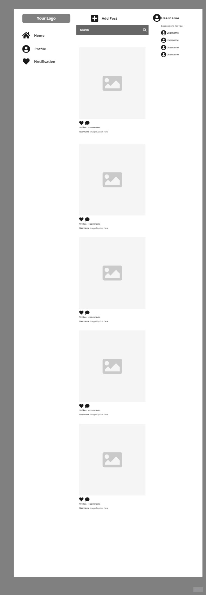
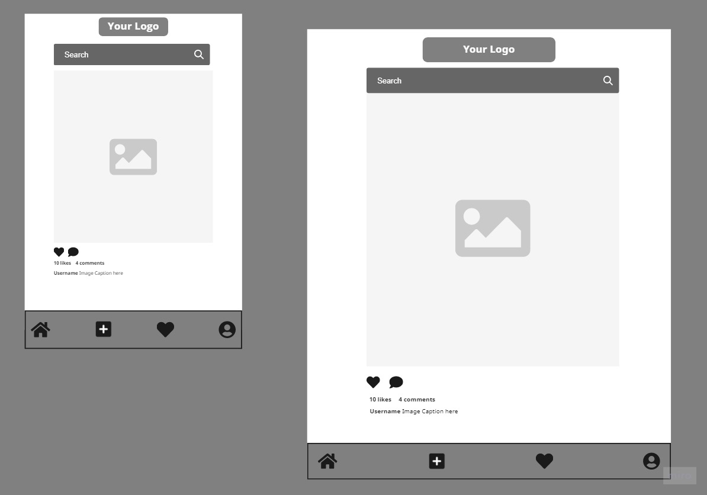
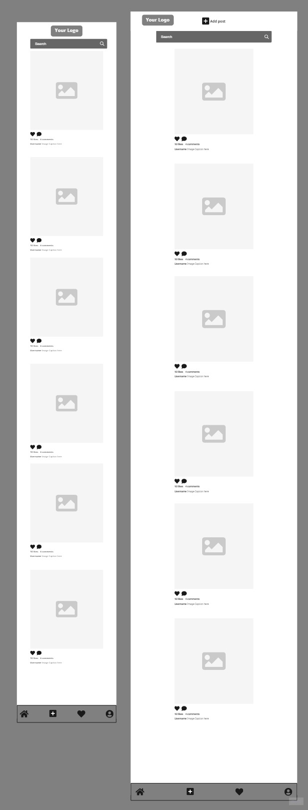

Post detail

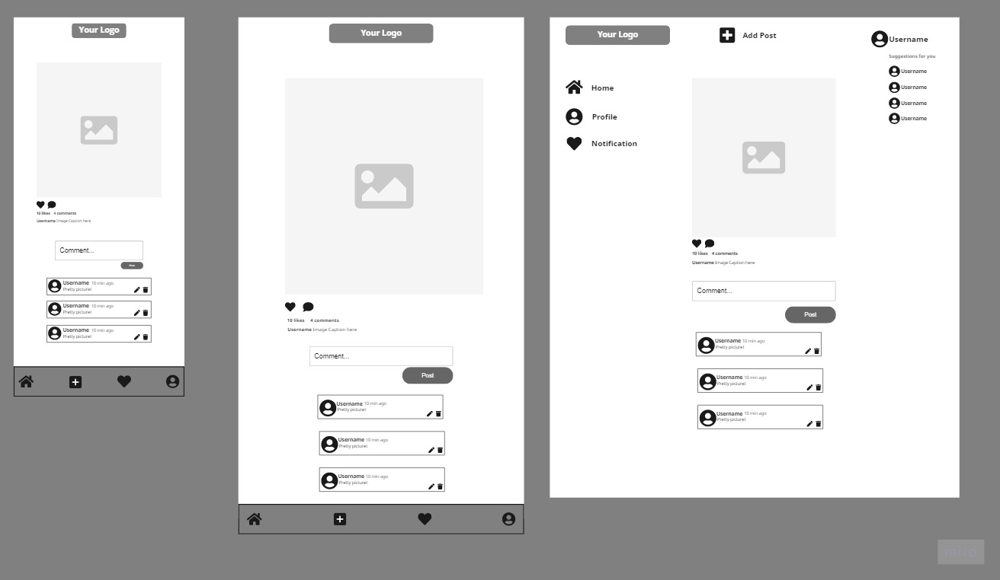

Signup

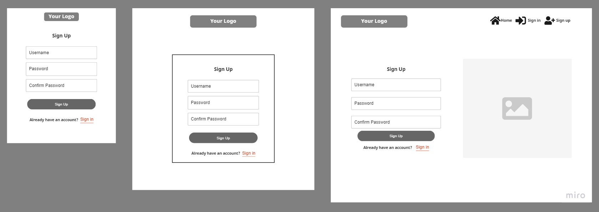

Sign in

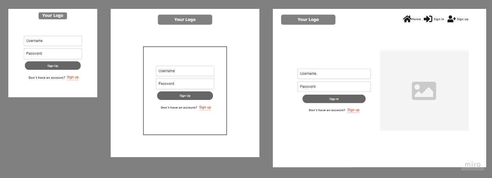

Upload

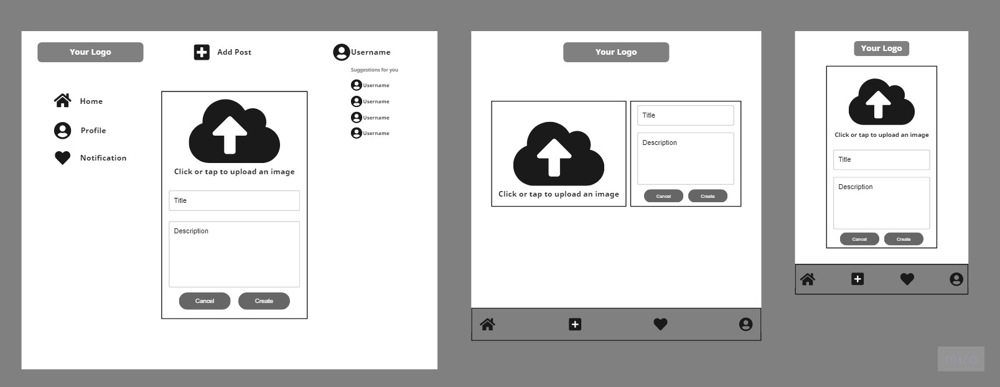

profile page from another users view

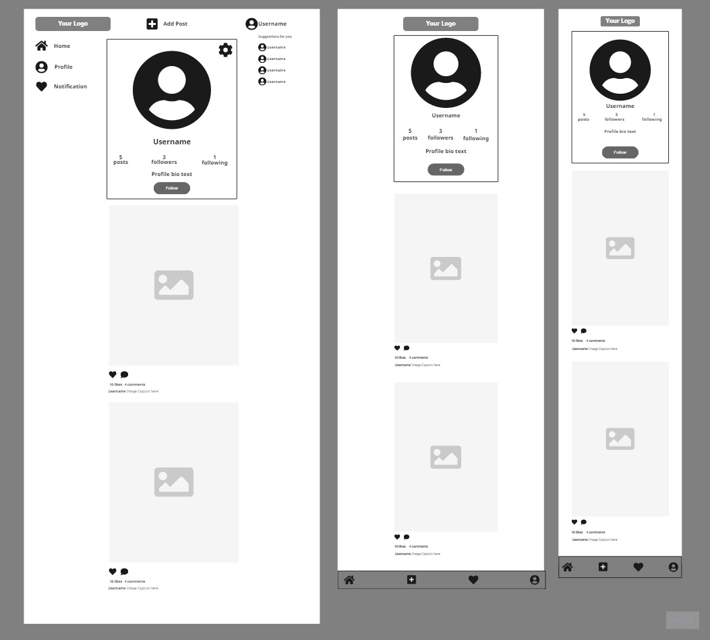

profile

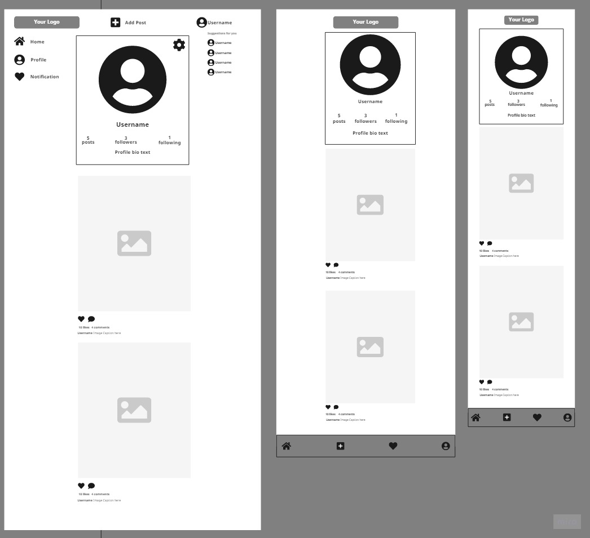

Edit profile

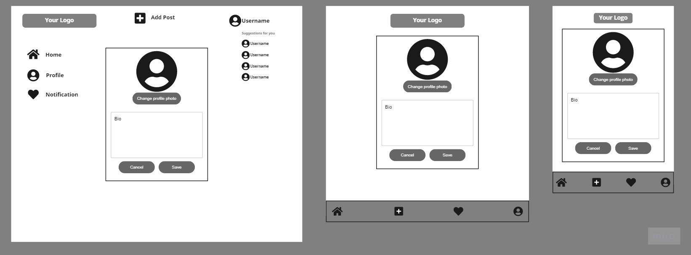

Change username

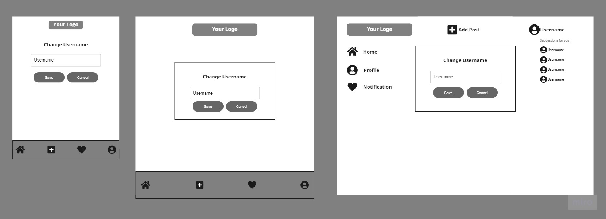

Liked posts

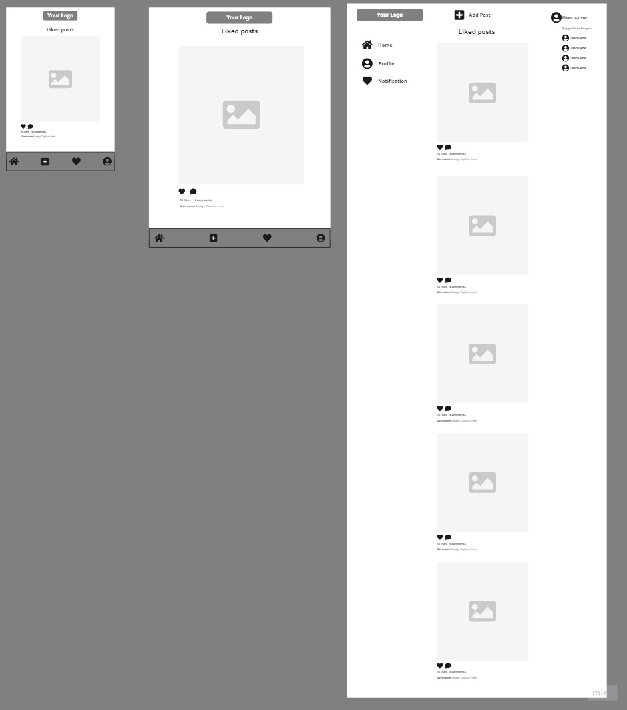

Buisness profile

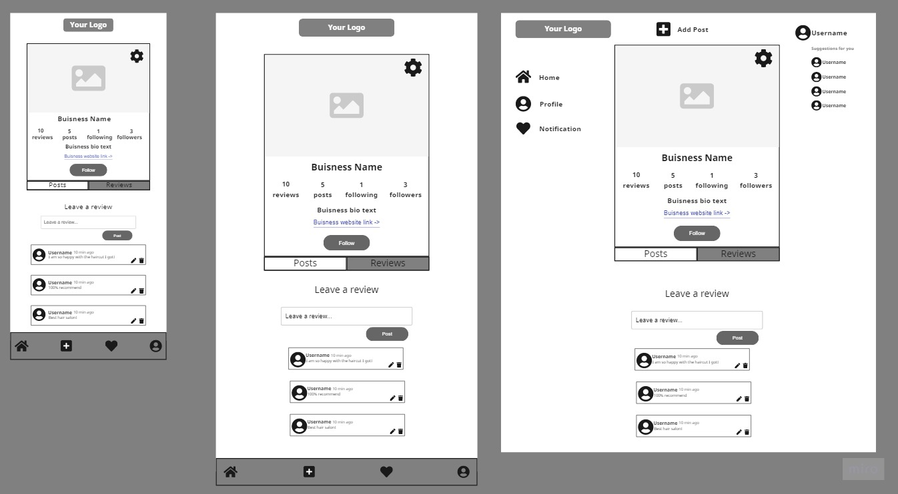

 

# User Experience UX

 

# Features

 

# Future Features

 

# Testing

 

# Technologies used

libraries
npm install react-bootstrap bootstrap
npm install react-router-dom
npm install axios
npm install react-router-dom

 

# Bugs

 

# Unfixed Bugs

 

# Deployment

 

# Credits
<a href="https://www.flaticon.com/free-icons/camera" title="camera icons">Camera icons created by Good Ware - Flaticon</a>

upload:
<a href="https://www.flaticon.com/free-icons/upload" title="upload icons">Upload icons created by Freepik - Flaticon</a>

 

# Acknowledgement

npm install bootstrap reactstrap axios --save
Bild av Artūras Kokorevas: https://www.pexels.com/sv-se/foto/ljus-vag-manniskor-gata-15954341/