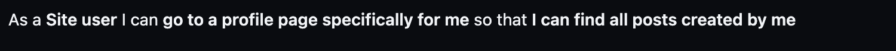

# React project
Welcome to Snap it! Snap it is the social media app is for everyone who wants to share their life with images and keep up with friends and family on what's going on in their life. Snap it is useful in many ways, people can easily keep up with what is trending regarding anything, like family events, fashion and their favourite celebrity! Anyone can create an account and start sharing images with their followers.

[Front-end live link](https://front-end-react.herokuapp.com/)

The frontend application is connected to Snap it's API.

[Back-end API repository](https://github.com/frirsta/drf-api-react)
 

[Back-end API deployment](https://drf-api-frirsta.herokuapp.com/)

 

* [**Project**](<#project>)
* [**Project Management**](<#project-management>)
* [**Design**](<#design>)
* [**Wireframes**](<#wireframes>)
* [**User Experience UX**](<#user-experience-ux>)
* [**Features**](<#features>)
* [**Future Features**](<#future-features>)
* [**Testing**](<#testing>)
* [**Technologies Used**](<#technologies-used>)
* [**Bugs**](<#bugs>)
* [**Unfixed Bugs**](<#unfixed-bugs>)
* [**Deployment**](<#deployment>)
* [**Credits**](<#credits>)
* [**Acknowledgement**](<#acknowledgement>)

 

# Project
Color palette
#94A7AE ljus blå
#c0a9bd lila
#F4F2F3 ljus lila
#64766A grön

 

# Project Management

I have used github issues to work with Snap it.

GitHub Issues

 

I have used the github project board to work with Snap it.

GitHub Board

 

 

# Design
Color Scheme

* #F4F2F3 has been used for the background to create a background that does not distract from the images shared by users.

* #F4F2F3 has been used for the sidebar, because it is an important feature for the users. Therefore, this color is perfect because it makes the sidebar easy to find.

# Wireframes

### I have used [Miro](https://miro.com/) to create WireFrames for the project.

Wireframes

Home page

Post detail

Signup

Sign in

Upload

profile page from another users view

profile

Edit profile

Change username

Liked posts

Buisness profile

 

# User Experience UX

## User story

 

# Features

 

# Future Features

 

# Testing

 

# Technologies used
libraries
npm install react-bootstrap bootstrap
npm install react-router-dom
npm install axios
npm install react-router-dom
npm install jwt-decode
npm install bootstrap reactstrap axios --save
npm install --save react-infinite-scroll-component
 

# Bugs

 

# Unfixed Bugs

 

# Deployment

 

# Credits
Sources that have helped build the website:

logo
<a href="https://www.flaticon.com/free-icons/camera" title="camera icons">Camera icons created by Freepik - Flaticon</a>

Favicon:
<a href="https://www.flaticon.com/free-icons/camera" title="camera icons">Camera icons created by Freepik - Flaticon</a>

<a href="https://www.flaticon.com/free-icons/camera" title="camera icons">Camera icons created by Good Ware - Flaticon</a>

Bild av Frans van Heerden: https://www.pexels.com/sv-se/foto/kall-sno-landskap-natur-624015/

upload:
<a href="https://www.flaticon.com/free-icons/upload" title="upload icons">Upload icons created by Freepik - Flaticon</a>
Bild av Artūras Kokorevas: https://www.pexels.com/sv-se/foto/ljus-vag-manniskor-gata-15954341/

<a href="https://www.flaticon.com/free-icons/user" title="user icons">User icons created by Freepik - Flaticon</a>

menu:
<a href="https://www.flaticon.com/free-icons/menu" title="menu icons">Menu icons created by Ayub Irawan - Flaticon</a>

posts:
Bild av Amine İspir: https://www.pexels.com/sv-se/foto/vag-par-romantisk-relation-14578722/
Bild av Matteo Milan: https://www.pexels.com/sv-se/foto/hav-strand-vatten-resa-15962125/
Bild av Taha Samet Arslan: https://www.pexels.com/sv-se/foto/staende-leende-romantik-sloja-15530666/
Bild av Diana Titenko: https://www.pexels.com/sv-se/foto/mode-solglasogon-semester-manniskor-3271945/
Bild av Gustavo Fring: https://www.pexels.com/sv-se/foto/man-par-karlek-kvinna-4148842/
Bild av Oliver  Morgan: https://www.pexels.com/sv-se/foto/tra-bank-landskap-solnedgang-16053779/
Bild av Taylen Lundequam: https://www.pexels.com/sv-se/foto/hav-molnig-vagor-kust-14775583/
Bild av Kübra Doğu: https://www.pexels.com/sv-se/foto/mat-tra-gryning-kaffe-9222655/
Bild av João  Jesus: https://www.pexels.com/sv-se/foto/ljus-mode-man-person-1080213/
Bild av Matheus Bertelli: https://www.pexels.com/sv-se/foto/hander-kvinna-flicka-sot-3764119/

 

# Acknowledgement

