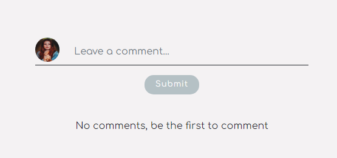
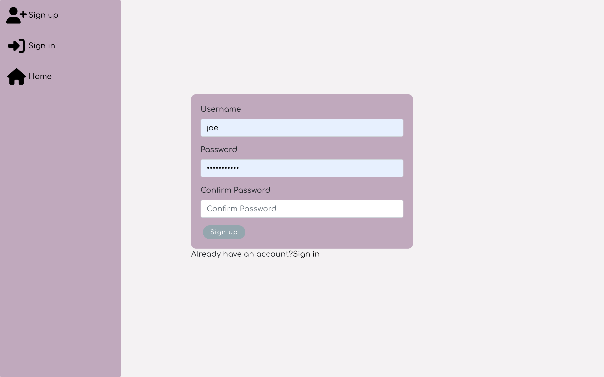
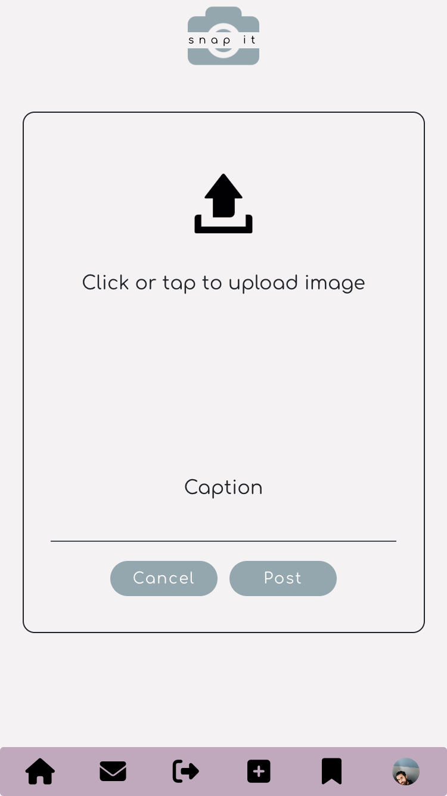
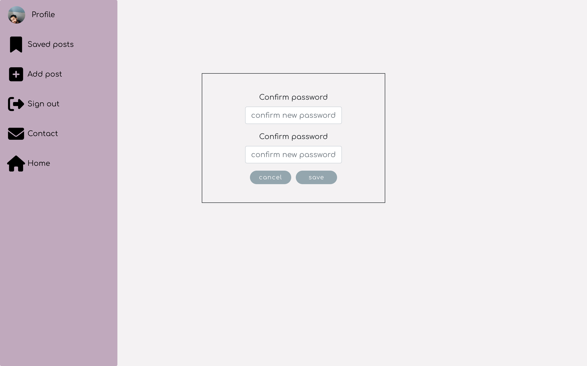
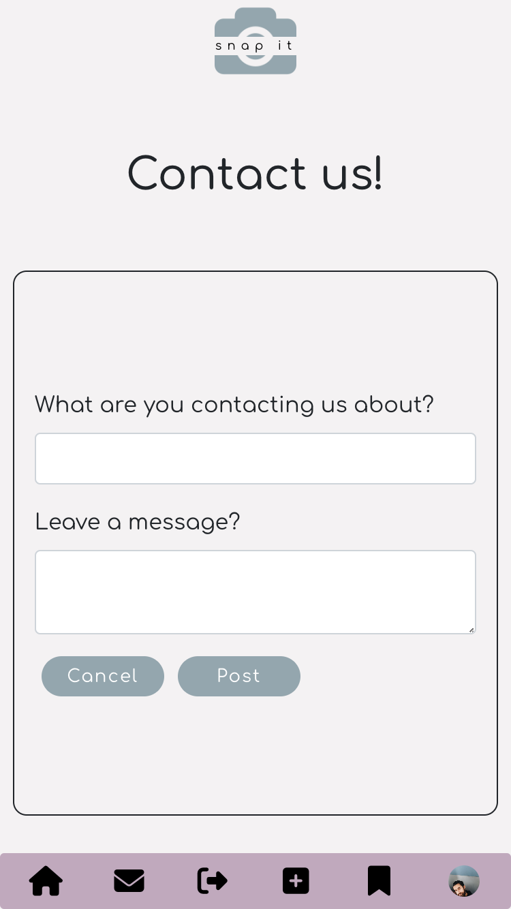
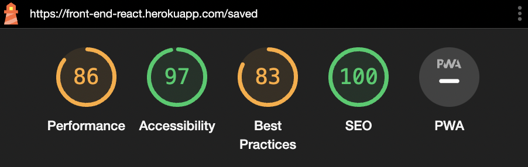

# Snap it

- [**Project**](#project)
- [**Project Management**](#project-management)
- [**Design**](#design)
- [**Wireframes**](#wireframes)
- [**User Experience UX**](#user-experience-ux)
- [**Features**](#features)
- [**Future Features**](#future-features)
- [**Testing**](#testing)
- [**Technologies Used**](#technologies-used)
- [**Bugs**](#bugs)
- [**Unfixed Bugs**](#unfixed-bugs)
- [**Deployment**](#deployment)
- [**Credits**](#credits)
- [**Acknowledgement**](#acknowledgement)

 

# Project

Welcome to Snap it! Snap it is the social media app is for everyone who wants to share their life with images and keep up with friends and family on what's going on in their life. Snap it is useful in many ways, people can easily keep up with what is trending regarding anything, like family events, fashion and their favourite celebrity! Anyone can create an account and start sharing images with their followers.

[Front-end live link](https://front-end-react.herokuapp.com/)
 

[Front-end repository](https://github.com/frirsta/react-front-end)

The front-end application is connected to Snap it's API.

[Back-end API repository](https://github.com/frirsta/drf-api-react)
 

[Back-end API deployment](https://drf-api-frirsta.herokuapp.com/)

 

# Project Management

## Agile methodology

I have used github issues to work with Snap it. They have been prioritized by four different labels.
 

- Must Have - Are the issues that have to be top priority.
- Should have - Are second priority.
- Could have - Third priority.
- Won't have - Is what will not be in the project.

The Won't have label is for long term use in the project and has not been used in this project.

GitHub Issues
 

 

I have used the github project board to work with Snap it.
 

 

 

# Design

Color Scheme

- #F4F2F3 has been used for the background to create a background that does not distract from the images shared by users.

- #c0a9bd has been used for the sidebar, because it is an important feature for the users. Therefore, this color is perfect because it makes the sidebar easy to find.

- The other colors have been chosen for the contrast and to make a visually aesthetic design.

# Wireframes

### I have used [Miro](https://miro.com/) to create WireFrames for the project.

Wireframes

Home page

Post detail

Signup

Sign in

Upload

profile page from another users view

profile

Edit profile

Change username

Liked posts

Buisness profile

 

# User Experience UX

User Story

# Features

Post detail

 

- All comments made on that post are displayed as a list under the image.
- The user can leave a comment in the post detail page.
- The owner of the post will have a dropdown menu on the top right corner of the post.

 

- Post drop-down menu.
- If the owner of the post clicks the trash can icon they delete the post.
- If the owner of the post clicks the pen to square icon, they get redirected to the update post page.

 

- The update post page is where the owner of the post can change the caption or image of the post.

Likes, comments and saved

 

 

- The bottom of the post has the number of likes, comments and saved displayed.
- When a user clicks the heart icon they like a post.
- When a user clicks the comments icon they get redirected to the post details page where they can leave a comment.
- When a user clicks the save icon they save the post, and they can find the post on the saved Posts page.

 

 

 

- The owner of the post can't like or save their own posts
- If the user who owns the account tries to like their own post a message will be displayed

 

 

- If a user is not signed in to an account, they can't like, comment or save a post.
- If they try, a message will be displayed as shown in the images above.

 

 

- In the post detail page the user can leave a comment.

 

 

- The comments are displayed as a list under the post.

 

 

- The owner of the comment will have a drop-down menu displayed on the top right corner.
- If the owner of the comment clicks the trash can icon they delete the comment.
- If the owner of the post clicks the pen to square icon, they will be able to change the content of the comment.

Navbar

- The sidebar/navbar when user is offline has a link to the home page, sign up page and sign in page.

- The navbar on a tablet and mobile screen.
 

 

- The sidebar/navbar when user is online has a link to the home page, contact page, sign out page, add post page, saved posts page and profile page.

- The navbar on a tablet and mobile screen.
 

 

All pages

Home page

<h3>Desktop</h3>

 

<h3>ipad</h3>

 

<h3>Mobile</h3>

 

Sign up page

<h3>Desktop</h3>

 

<h3>ipad</h3>

 

<h3>Mobile</h3>

 

Sign in page

<h3>Desktop</h3>

 

<h3>ipad</h3>

 

<h3>Mobile</h3>

 

Upload page

<h3>Desktop</h3>

 

<h3>ipad</h3>

 

<h3>Mobile</h3>

 

Profile page

<h3>Desktop</h3>

 

<h3>ipad</h3>

 

<h3>Mobile</h3>

 

- Account drop-down menu.
- If the owner of the account clicks update profile, they get redirected to the update profile page.
- If the owner of the account clicks update username, they get redirected to the update username page.
- If the owner of the account clicks change password, they get redirected to the change password page.

 

Update profile page

<h3>Desktop</h3>

 

<h3>ipad</h3>

 

<h3>Mobile</h3>

 

Change password page

<h3>Desktop</h3>

 

<h3>ipad</h3>

 

<h3>Mobile</h3>

 

Change username page

<h3>Desktop</h3>

 

<h3>ipad</h3>

 

<h3>Mobile</h3>

 

Saved posts page

<h3>Desktop</h3>

 

<h3>ipad</h3>

 

<h3>Mobile</h3>

 

Contact page

<h3>Desktop</h3>

 

<h3>ipad</h3>

 

<h3>Mobile</h3>

 

# Future Features

- Add business profile so user can create an account for their business.
- Add admin dashboard
- Add upload video function
- Add more testing to application

 

# Testing

- HTML pass [W3C HTML](https://validator.w3.org/) with no error
   

- CSS pass [W3C CSS](https://jigsaw.w3.org/) with no error
 

    

 

The website has also been tested with the Chrome developer tool Google Lighthouse. It has been tested for desktop and for mobile. What was tested:

- Performance
- Accessibility
- Best Practices
- SEO (Search engine optimisation)
   

Lighthouse

home page

<h3>Desktop</h3>

 

<h3>Mobile</h3>

 

signup page

<h3>Desktop</h3>

 

<h3>Mobile</h3>

 

signin page

<h3>Desktop</h3>

 

<h3>Mobile</h3>

 

upload page

<h3>Desktop</h3>

 

<h3>Mobile</h3>

 

profile page

<h3>Desktop</h3>

 

<h3>Mobile</h3>

 

update profile page

<h3>Desktop</h3>

 

<h3>Mobile</h3>

 

change password page

<h3>Desktop</h3>

 

<h3>Mobile</h3>

 

change username page

<h3>Desktop</h3>

 

<h3>Mobile</h3>

 

saved posts page

<h3>Desktop</h3>

 

<h3>Mobile</h3>

 

contact page

<h3>Desktop</h3>

 

<h3>Mobile</h3>

# Technologies used

- React
- React-Bootstrap
- Django rest framework
- HTML
- CSS
- JavaScript
- JSX

Libraries

- GitPod
- Git
- GitHub
- React
- Axios
- React Router
- JWT
- React-Bootstrap
- Heroku
- Google Fonts
- Font Awesome
- Toastify

 

# Bugs

 

# Unfixed Bugs

 

# Deployment

This website was deployed to [Heroku](https://heroku.com/). To deploy the website follow the steps below:

1. Log in or create an account on heroku.

2. On the heroku Website click 'New' and after click 'Create new app'.

3. Write the app name, choose a region and then click 'Create app'.

4. In the application website click 'Deploy' on the navigation menu.

5. In the 'Deploy' page, click the GitHub logo. Search for the GitHub repository that was made for this project.

6. Search for the GitHub repository that was made for this project.

7. When the repository is found click 'Connect'.

8. Scroll down to manual deploy and make sure you have chosen the main branch.

9. Click deploy.

 

# Credits

Sources that have helped build the website:

logo
<a href="https://www.flaticon.com/free-icons/camera" title="camera icons">Camera icons created by Freepik - Flaticon</a>

Favicon:
<a href="https://www.flaticon.com/free-icons/camera" title="camera icons">Camera icons created by Freepik - Flaticon</a>

<a href="https://www.flaticon.com/free-icons/camera" title="camera icons">Camera icons created by Good Ware - Flaticon</a>

Bild av Frans van Heerden: https://www.pexels.com/sv-se/foto/kall-sno-landskap-natur-624015/

upload:
<a href="https://www.flaticon.com/free-icons/upload" title="upload icons">Upload icons created by Freepik - Flaticon</a>
Bild av Artūras Kokorevas: https://www.pexels.com/sv-se/foto/ljus-vag-manniskor-gata-15954341/

<a href="https://www.flaticon.com/free-icons/user" title="user icons">User icons created by Freepik - Flaticon</a>

menu:
<a href="https://www.flaticon.com/free-icons/menu" title="menu icons">Menu icons created by Ayub Irawan - Flaticon</a>

posts:
Bild av Amine İspir: https://www.pexels.com/sv-se/foto/vag-par-romantisk-relation-14578722/
Bild av Matteo Milan: https://www.pexels.com/sv-se/foto/hav-strand-vatten-resa-15962125/
Bild av Taha Samet Arslan: https://www.pexels.com/sv-se/foto/staende-leende-romantik-sloja-15530666/
Bild av Diana Titenko: https://www.pexels.com/sv-se/foto/mode-solglasogon-semester-manniskor-3271945/
Bild av Gustavo Fring: https://www.pexels.com/sv-se/foto/man-par-karlek-kvinna-4148842/
Bild av Oliver Morgan: https://www.pexels.com/sv-se/foto/tra-bank-landskap-solnedgang-16053779/
Bild av Taylen Lundequam: https://www.pexels.com/sv-se/foto/hav-molnig-vagor-kust-14775583/
Bild av Kübra Doğu: https://www.pexels.com/sv-se/foto/mat-tra-gryning-kaffe-9222655/
Bild av João Jesus: https://www.pexels.com/sv-se/foto/ljus-mode-man-person-1080213/
Bild av Matheus Bertelli: https://www.pexels.com/sv-se/foto/hander-kvinna-flicka-sot-3764119/

Bild av Cristian Muduc: https://www.pexels.com/sv-se/foto/manniskor-vatten-reser-italien-10146128/
Bild av Mikhail Nilov: https://www.pexels.com/sv-se/foto/blommor-pask-bestick-porslin-6957717/
Bild av Valeriya Kobzar: https://www.pexels.com/sv-se/foto/drycker-glas-bord-firande-8630148/
Bild av Justyna Serafin: https://www.pexels.com/sv-se/foto/hav-vatten-batar-yachter-13563441/
Bild av Amar Preciado: https://www.pexels.com/sv-se/foto/kaffe-bar-kafe-ta-bilder-16230535/
Bild av Lorenzo Castellino: https://www.pexels.com/sv-se/foto/hav-gryning-landskap-solnedgang-15636474/
Bild av Lany-Jade Mondou: https://www.pexels.com/sv-se/foto/stad-solglasogon-kvinna-byggnader-14460412/
Bild av Efe Ersoy: https://www.pexels.com/sv-se/foto/karlek-sommar-sol-tradgard-14905759/
Bild av Efe Ersoy: https://www.pexels.com/sv-se/foto/karlek-sommar-sol-tradgard-14905759/
Bild av sora: https://www.pexels.com/sv-se/foto/vinter-park-blad-oskarpa-15637648/
Bild av Mitch Lally: https://www.pexels.com/sv-se/foto/landskap-bergen-hotell-sjo-15032293/
Bild av arteliusnis : https://www.pexels.com/sv-se/foto/byggnader-monster-arkitektur-fonster-5338350/
Bild av Ayako S: https://www.pexels.com/sv-se/foto/brod-mat-tra-gryning-15640312/
Bild av Majo Pestaña : https://www.pexels.com/sv-se/foto/vaxt-blomma-blomning-botanik-16172618/
Bild av Mikkel Kvist: https://www.pexels.com/sv-se/foto/stad-gata-byggnad-flaggor-15949542/
Bild av Polina Kovaleva: https://www.pexels.com/sv-se/foto/stad-himmel-semester-frankrike-5507232/
Bild av Kadir Akman: https://www.pexels.com/sv-se/foto/fagel-djur-papegoja-ara-ararauna-15912424/
Bild av Marina Leonova: https://www.pexels.com/sv-se/foto/skog-bord-terrass-plats-installning-9433045/
Bild av Andrea Piacquadio: https://www.pexels.com/sv-se/foto/kvinna-smartphone-flicka-trad-3775087/
Bild av Masha Raymers: https://www.pexels.com/sv-se/foto/gryning-mode-person-kvinna-2726111/
Bild av R. Fera: https://www.pexels.com/sv-se/foto/svartvitt-mode-man-person-432059/

 

# Acknowledgement
